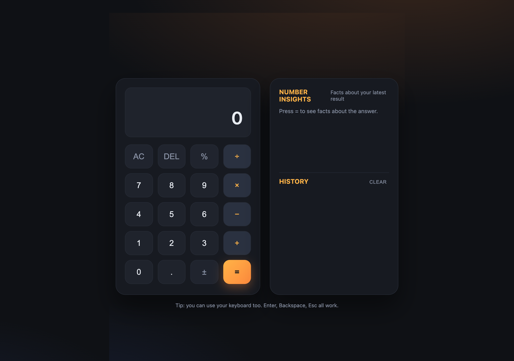

# Calculator

<p align="center">
  
  
</p>

Small calculator I built one evening. Does the usual math, but I added a little side panel that shows random facts about whatever number you just calculated. Felt like a fun extra.

## The fun part

Every time you hit equals, the side panel tells you stuff about the result:

- is it prime
- prime factors
- binary and hex
- square root, squared
- factorial (only for small ones, otherwise the number gets crazy)
- roman numerals up to 1000

So if you calculate 42, you also learn that 42 is `2 × 3 × 7` and looks like `XLII` in roman. Useless? Maybe. Fun? I think so.

## What it does

- the four basics: plus, minus, times, divide
- percent and sign flip
- history list, click an old result to bring it back
- keyboard works too, Enter for equals, Backspace to delete, Esc to clear
- looks fine on phones

## Run it

No build step, no npm, nothing. Just open the html file.

```
git clone https://github.com/secanakbulut/calculator.git
cd calculator
open index.html
```

That is it.

## Files

- `index.html` the layout
- `style.css` the look
- `script.js` math, history and the insight panel

## License

MIT, do whatever you want with it.
